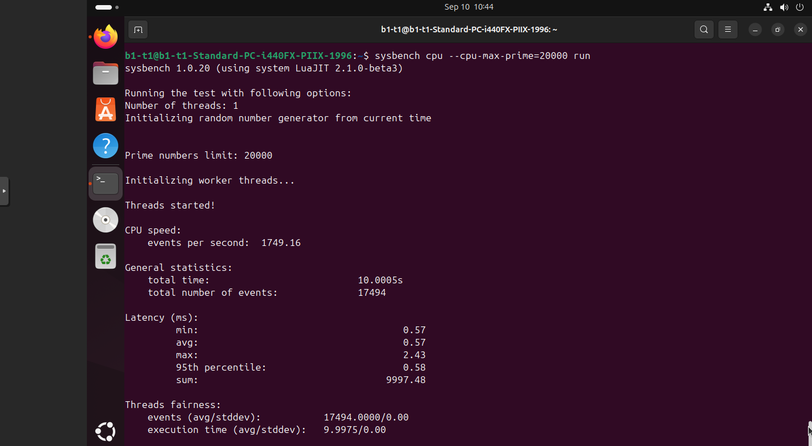
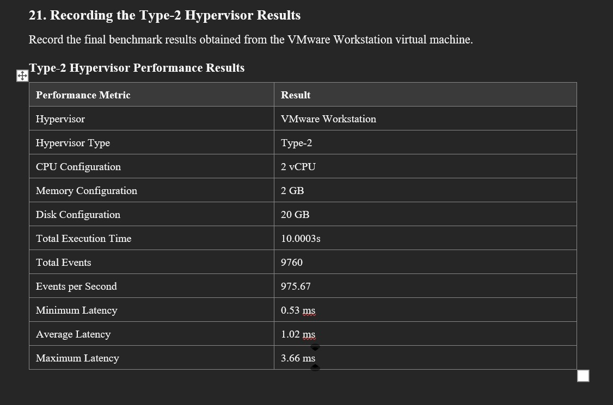

<div align="center">

# ☁️ Cloud Computing Lab
### Hypervisor Setup & CPU Benchmark Study

**A hands-on comparison of Type-1 and Type-2 virtualization**  
Proxmox VE (KVM) · VMware Workstation · Ubuntu · Sysbench


</div>

---

## ✨ Project overview

This repository documents a cloud computing lab in which an Ubuntu virtual machine was configured on two hypervisor platforms. The practical work covers VM provisioning, guest system checks, resource monitoring, and a CPU benchmark using Sysbench.

| Lab | Platform | What the screenshots document |
|---|---|---|
| **Part A · Type-1** | Proxmox VE / KVM | VM setup, running guest, Ubuntu checks, resource monitoring, Sysbench output |
| **Part B · Type-2** | VMware Workstation | VM wizard and hardware settings, Ubuntu checks, Sysbench installation and output |

## 📊 Recorded benchmark results

The included screenshots show these results from `sysbench cpu --cpu-max-prime=20000 run`:

| Metric | Proxmox VE · Type-1 | VMware Workstation · Type-2 |
|---|---:|---:|
| Events per second | **1,749.16** | **975.67** |
| Total events | 17,494 | 9,760 |
| Test duration | 10.005 s | 10.0003 s |
| Average latency | 0.57 ms | 1.02 ms |
| Minimum latency | 0.57 ms | 0.53 ms |
| Maximum latency | 2.43 ms | 3.66 ms |
| 95th percentile latency | 0.58 ms | Not shown in the supplied VMware result image |

In these recorded runs, Proxmox completed about **79.3% more events per second** than VMware Workstation. This summarizes the submitted runs only; it is not a controlled universal ranking of hypervisors. CPU scheduling, host load, VM settings, and run-to-run variation can affect benchmark results.

## 🧪 Experiment at a glance

### Type-1 · Proxmox VE

The VM configuration screenshot shows 2 CPU cores, 2,048 MB memory, and a 20 GB disk. The screenshots also document Ubuntu running in the guest, system and resource checks, and the benchmark output.

<details>
<summary><strong>View the Proxmox benchmark result</strong></summary>
<br>



</details>

### Type-2 · VMware Workstation

The VMware screenshots document VM creation and the CPU, memory, and disk configuration, followed by Ubuntu system checks and the Sysbench run.

<details>
<summary><strong>View the VMware benchmark result</strong></summary>
<br>



</details>

## 🗂️ Repository map

```text
Cloud-Computing-Lab/
├── README.md
├── LAB_REPORT.md
└── images/
    ├── type1-proxmox/   # Proxmox setup, guest checks, monitoring, benchmark
    └── type2-vmware/    # VMware setup, guest checks, benchmark
```

Browse the full screenshot galleries: [Type-1 · Proxmox](images/type1-proxmox/) · [Type-2 · VMware](images/type2-vmware/)

## ▶️ Reproduce the CPU benchmark

On each Ubuntu guest, install Sysbench and run the same workload:

```bash
sudo apt update
sudo apt install -y sysbench
sysbench --version
sysbench cpu --cpu-max-prime=20000 run
```

For a useful comparison, record each VM's assigned CPU and memory, guest OS, Sysbench version, host activity, full output, and number of threads. Repeat runs under similar conditions and report the range or average as well as individual results.

## 🧠 What this lab demonstrates

- How a Type-1 hypervisor and a hosted Type-2 hypervisor place virtualization layers differently.
- How to provision a Linux guest and verify its hostname, CPU, memory, and disk.
- How to collect benchmark throughput and latency measurements.
- Why benchmark results need consistent conditions and careful interpretation.

See [LAB_REPORT.md](LAB_REPORT.md) for the detailed procedure, architecture notes, observations, and limitations.

---

<div align="center">
Made for a Cloud Computing laboratory · Screenshots and measurements from the submitted lab materials
</div>
