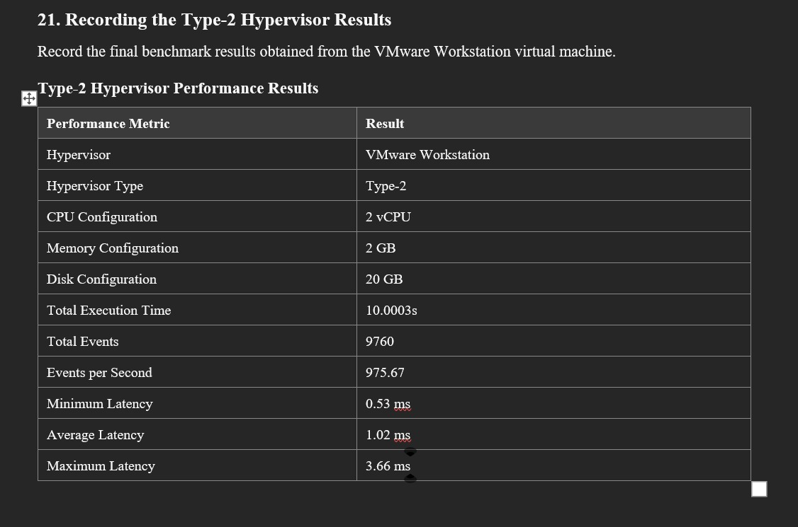

## ✨ Project overview

This repository documents a cloud computing lab in which an Ubuntu virtual machine was configured on two hypervisor platforms. The practical work covers VM provisioning, guest system checks, resource monitoring, and a CPU benchmark using Sysbench.

| Lab | Platform | What the screenshots document |
|---|---|---|
| **Part A · Type-1** | Proxmox VE / KVM | VM setup, running guest, Ubuntu checks, resource monitoring, Sysbench output |
| **Part B · Type-2** | VMware Workstation | VM wizard and hardware settings, Ubuntu checks, Sysbench installation and output |

### Hypervisor Performance Analysis
Type-1 vs Type-2 Hypervisor Comparison Proxmox VE (Type-1) vs VMware Workstation (Type-2)

## What is this experiment?

We test two types of hypervisors.

A hypervisor is software that runs virtual machines (VMs).

Type-1 hypervisor — installs directly on a server. No host OS. Example: Proxmox VE.

Type-2 hypervisor — installs on top of a normal OS, like an app. Example: VMware Workstation.

We create the same Ubuntu VM on both.

We run a CPU test called Sysbench on both.

We compare the results.

We check which hypervisor is faster.


## 📊 Recorded benchmark results

The included screenshots show these results from `sysbench cpu --cpu-max-prime=20000 run`:

| Metric | Proxmox VE · Type-1 | VMware Workstation · Type-2 |
|---|---:|---:|
| Events per second | **1,749.16** | **975.67** |
| Total events | 17,494 | 9,760 |
| Test duration | 10.005 s | 10.0003 s |
| Average latency | 0.57 ms | 1.02 ms |
| Minimum latency | 0.57 ms | 0.53 ms |
| Maximum latency | 2.43 ms | 3.66 ms |
| 95th percentile latency | 0.58 ms | Not shown in the supplied VMware result image |

In these recorded runs, Proxmox completed about **79.3% more events per second** than VMware Workstation. This summarizes the submitted runs only; it is not a controlled universal ranking of hypervisors. CPU scheduling, host load, VM settings, and run-to-run variation can affect benchmark results.

## 🧪 Experiment at a glance

### Type-1 · Proxmox VE

The VM configuration screenshot shows 2 CPU cores, 2,048 MB memory, and a 20 GB disk. The screenshots also document Ubuntu running in the guest, system and resource checks, and the benchmark output.

<details>
<summary><strong>View the Proxmox benchmark result</strong></summary>
<br>


</details>

### Type-2 · VMware Workstation

The VMware screenshots document VM creation and the CPU, memory, and disk configuration, followed by Ubuntu system checks and the Sysbench run.

<details>
<summary><strong>View the VMware benchmark result</strong></summary>
<br>



</details>

## 🗂️ Repository map

```text
Cloud-Computing-Lab/
├── README.md
├── LAB_REPORT.md
└── images/
    ├── type1-proxmox/   # Proxmox setup, guest checks, monitoring, benchmark
    └── type2-vmware/    # VMware setup, guest checks, benchmark
```

Browse the full screenshot galleries: [Type-1 · Proxmox](images/type1-proxmox/) · [Type-2 · VMware](images/type2-vmware/)

## ▶️ Reproduce the CPU benchmark

On each Ubuntu guest, install Sysbench and run the same workload:

```bash
sudo apt update
sudo apt install -y sysbench
sysbench --version
sysbench cpu --cpu-max-prime=20000 run
```

For a useful comparison, record each VM's assigned CPU and memory, guest OS, Sysbench version, host activity, full output, and number of threads. Repeat runs under similar conditions and report the range or average as well as individual results.

## 🧠 What this lab demonstrates

- How a Type-1 hypervisor and a hosted Type-2 hypervisor place virtualization layers differently.
- How to provision a Linux guest and verify its hostname, CPU, memory, and disk.
- How to collect benchmark throughput and latency measurements.
- Why benchmark results need consistent conditions and careful interpretation.

See [LAB_REPORT.md](LAB_REPORT.md) for the detailed procedure, architecture notes, observations, and limitations.

--

### Before you start (prerequisites) :
-Proxmox VE server address, port 8006, and login details.

-VMware Workstation installed on your computer.

-An Ubuntu ISO file.

-At least 20 GB free disk space.

-At least 4 GB free RAM.

-Git installed on your computer.

-A GitHub account.


### Steps we followed:

1.Logged in to Proxmox VE.

2.Created an Ubuntu VM (2 vCPU, 2 GB RAM, 20 GB disk).

3.Started the VM and installed Ubuntu.

4.Checked CPU and memory using lscpu and free -h.

5.Installed Sysbench.

6.Ran the CPU benchmark on Proxmox VM.

7.Repeated the same steps in VMware Workstation.

8.Ran the CPU benchmark on VMware VM.

9.Compared both results.

10.Saved screenshots as proof.

### Screenshot file names

## Proxmox VE (screenshots/type1-proxmox/)

01-proxmox-dashboard.png

02-proxmox-vm-configuration.png

03-proxmox-vm-running.png

04-proxmox-ubuntu-console.png

05-proxmox-system-configuration.png

06-proxmox-sysbench-result.png

07-proxmox-resource-monitoring.png


## VMware Workstation (screenshots/type2-vmware/)

01-vmware-vm-configuration.jpeg

02-vmware-vm-running.jpeg

03-vmware-system-configuration.jpeg

04-vmware-sysbench-result.jpeg

Comparison (screenshots/comparison/)

01-hypervisor-performance-comparison.jpeg

## How to upload to GitHub
1.Go to your GitHub repository.

2.Click Add file → Upload files.

3.Drag in the folders and files.

4.Click Commit changes.

# Or using Git commands:
```python
cd CC-Experiment-01-Hypervisor-Analysis

git init

git add .

git commit -m "Add hypervisor performance analysis experiment"

git branch -M main

git remote add origin https://github.com/<your-username>/<your-repo-name>.git

git push -u origin main

```
