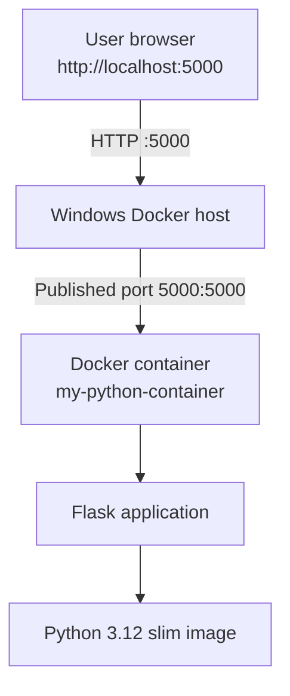
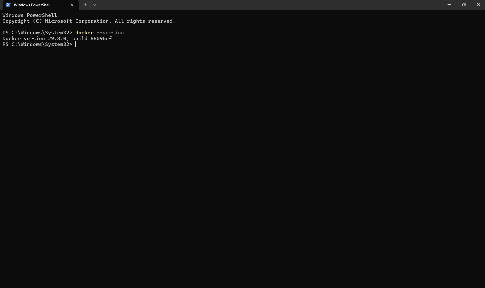
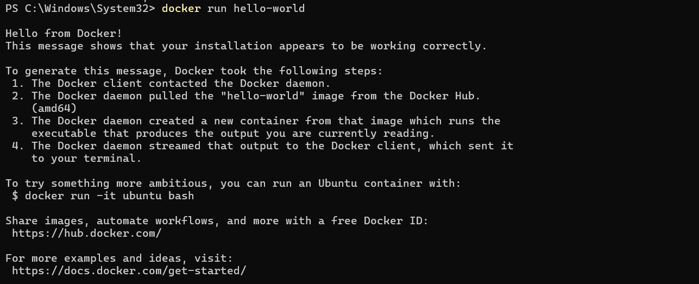
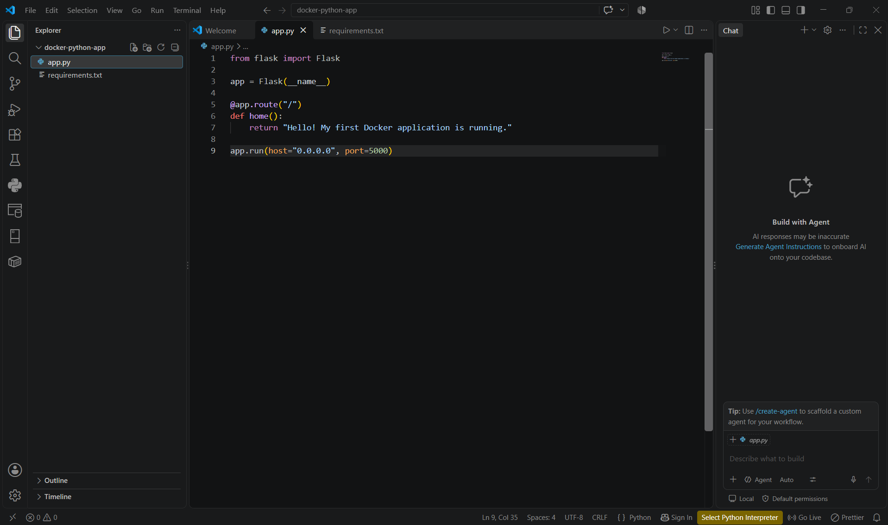
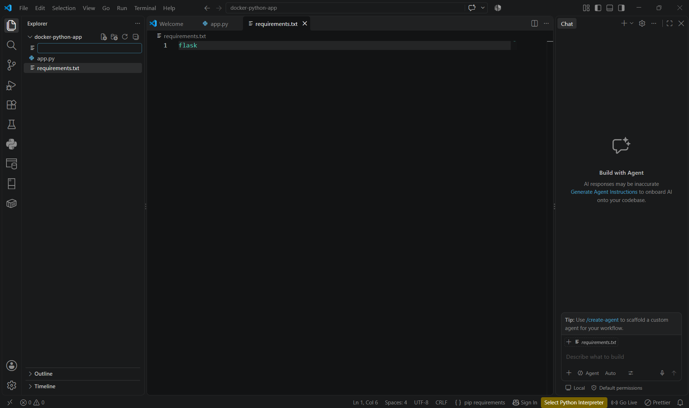
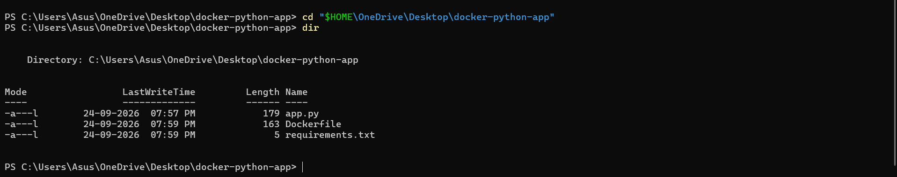
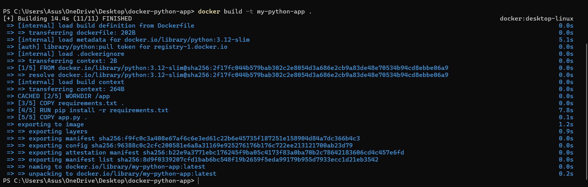
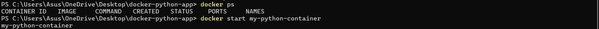
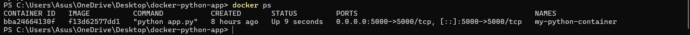

# Dockerized Python Flask Application

  

## Overview

This Cloud Computing laboratory experiment packages a small Python Flask web application into a Docker image and runs it locally with Docker Desktop on Windows. The container publishes port 5000 to the Windows host, where the application is accessed in a browser at `http://localhost:5000`.

This repository records a local Docker experiment. It does not document a cloud deployment.

## Objectives

- Verify the Docker installation and run Docker's `hello-world` image.
- Create a simple Flask application and declare its dependency in `requirements.txt`.
- Define the image build with a Dockerfile and build `my-python-app`.
- Run the application in a container and map container port 5000 to host port 5000.
- Open the application in a browser and verify the image and container with Docker commands.

## Technologies Used

| Technology | Purpose |
|---|---|
| Python | Application programming language |
| Flask | Web framework |
| Docker | Containerization |
| Docker Desktop | Local Docker environment on Windows |
| PowerShell | Command-line interface used during the experiment |
| `python:3.12-slim` | Base Docker image |
| Web browser | Local application testing |

## Architecture

The browser sends an HTTP request to the host's port 5000. Docker forwards it to port 5000 in the local container, where Flask responds.



## Project Structure

```text
dockerized-python-flask-app/
├── app.py
├── requirements.txt
├── Dockerfile
├── README.md
├── .gitignore
├── LICENSE
└── docs/
    ├── LAB_REPORT.md
    └── screenshots/
        ├── 01_Docker_Version_Verification.png
        ├── 02_Docker_Hello_World_Test.png
        ├── 03_Creating_Docker_Project_Directory.png
        ├── 04_Flask_Application_app_py.png
        ├── 05_Python_Requirements_File.png
        ├── 06_Dockerfile_Creation.png
        ├── 07_Verifying_Project_Files.png
        ├── 08_Docker_Image_Build.png
        ├── 09_Docker_Image_Verification.png
        ├── 10_Docker_Container_Status.png
        ├── 11_Docker_Container_Running.png
        └── 12_Flask_Application_Browser_Output.png
```

## Application Code

`app.py` creates a Flask application with one route, `/`. The route returns a plain-text greeting. The server binds to `0.0.0.0` on port `5000` so it can accept requests forwarded to the container's network interface.

```python
from flask import Flask

app = Flask(__name__)

@app.route("/")
def home():
    return "Hello! My first Docker application is running."

app.run(host="0.0.0.0", port=5000)
```

## requirements.txt

The file lists Flask, the Python package required by `app.py`. The Docker build installs it with pip.

```text
flask
```

## Dockerfile Explanation

| Instruction | Purpose |
|---|---|
| `FROM` | Selects the `python:3.12-slim` base image. |
| `WORKDIR` | Sets `/app` as the working directory in the image. |
| `COPY` | Copies the dependency list and application code into the image. |
| `RUN` | Installs Flask during image build. |
| `EXPOSE` | Documents that the application listens on port 5000. |
| `CMD` | Starts the Flask application when the container runs. |

```dockerfile
FROM python:3.12-slim

WORKDIR /app

COPY requirements.txt .

RUN pip install -r requirements.txt

COPY app.py .

EXPOSE 5000

CMD ["python", "app.py"]
```

## How to Run

These are the experiment's PowerShell commands. Docker Desktop must be installed and running. The initial project directory used during the experiment was `C:\Users\Asus\OneDrive\Desktop\docker-python-app`.

```powershell
docker --version
docker run hello-world

cd "$HOME\OneDrive\Desktop"
mkdir docker-python-app
cd docker-python-app
pwd
dir

docker build -t my-python-app .
docker images
docker run -d -p 5000:5000 --name my-python-container my-python-app
docker ps
```

After the container is running, open [http://localhost:5000](http://localhost:5000) in a browser.

> The commands above reproduce the directory setup and build flow used in the lab. If you have cloned this repository, run `docker build -t my-python-app .` from the repository directory instead of creating another project folder.

## Existing Container Name Issue

The command to create a container reported a name conflict because `my-python-container` was already assigned to an existing container. This was not a Docker installation failure. The existing container was started instead of creating a duplicate:

```powershell
docker ps -a
docker start my-python-container
docker ps
```

The running container was shown with port mapping `0.0.0.0:5000->5000/tcp`, and the Flask page was then opened at `http://localhost:5000`.

## Verification

- `docker images` lists locally available images, including `my-python-app` after a successful build.
- `docker ps` lists running containers and their published ports.
- `docker ps -a` lists all containers, including stopped containers; it was used to identify the pre-existing named container.

## Application Output

The browser displayed:

> Hello! My first Docker application is running.


## Screenshots / Experiment Evidence

The screenshots below are the supplied experiment evidence, copied into this repository without changing their image contents.

| No. | Screenshot | Description |
|---:|---|---|
| 1 |  | Verifies Docker installation. |
| 2 |  | Tests Docker by running `hello-world`. |
| 3 |  | Creates the project directory. |
| 4 |  | Shows `app.py`. |
| 5 |  | Shows the Flask dependency. |
| 6 |  | Shows the container configuration. |
| 7 |  | Verifies the project files. |
| 8 |  | Builds `my-python-app`. |
| 9 |  | Shows the built image. |
| 10 |  | Checks container status. |
| 11 |  | Shows the running container and port mapping. |
| 12 |  | Shows the successful Flask response. |

## What I Learned

- A Docker image is the packaged template used to create containers; a container is a running instance of an image.
- A Dockerfile records the base image, working directory, files, dependency installation, and startup command used to build the application image.
- Port mapping with `-p 5000:5000` connects host port 5000 to container port 5000, allowing the browser to reach Flask at `localhost:5000`.
- Binding Flask to `0.0.0.0` allows it to listen on the container's network interfaces. Binding only to `127.0.0.1` inside the container would not make it reachable through the published port.
- Containers have a lifecycle. A container with the requested name already existed, so it was started with `docker start` and checked with `docker ps`.
- The image provides a separate application environment with Python and Flask packaged together, reducing reliance on packages installed directly on the host.

## Troubleshooting

1. **Desktop path:** `C:\Users\Asus\Desktop` did not exist in the experiment because the Desktop folder was under OneDrive. The working directory was reached with `cd "$HOME\OneDrive\Desktop"`.
2. **Container name conflict:** `my-python-container` was already assigned to an existing container. The container was inspected with `docker ps -a` and started with `docker start my-python-container`.

## Conclusion

The Flask application was packaged into the `my-python-app` Docker image, run locally as `my-python-container`, and made reachable through port 5000. The browser displayed the expected response at `localhost:5000`.

## Future Scope

The following items are possible future work and were not performed in this experiment:

- Docker Compose
- Publishing the image to Docker Hub
- CI/CD
- Kubernetes deployment
- Cloud deployment
- Container health checks
- Running behind a production WSGI server
